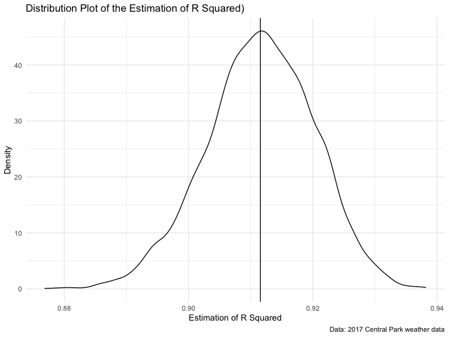
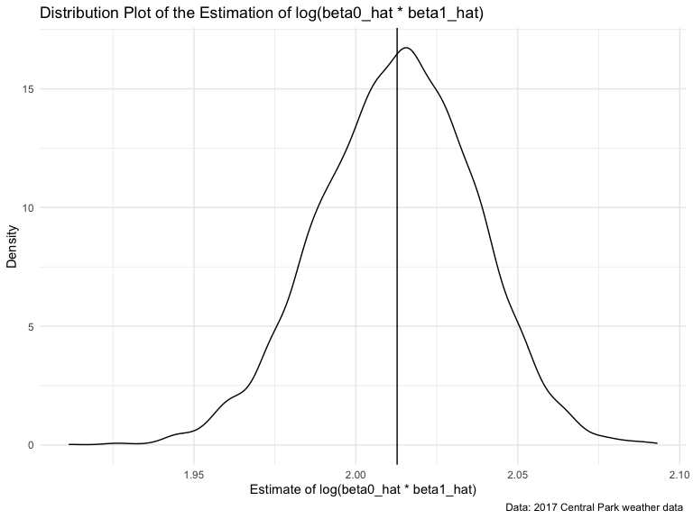

Homework 6
================
Yan Song
2020-12-08

### Due date

Due: December 9 at 10:00pm.

### Points

  - Problem 0: 20 points
  - Problem 1: – points
  - Problem 2: 40 points
  - Problem 3: 40 points

### Problem 0

This “problem” focuses on structure of your assignment, including the
use of R Markdown to write reproducible reports, the use of R Projects
to organize your work, the use of relative paths to load data, and the
naming structure for your files.

To that end:

  - create a public GitHub repo + local R Project for this assignment
  - write solutions using a .Rmd file that outputs a `github_document` /
    .md file
  - submit a link to your repo via Courseworks

Your solutions to Problems 1 and 2 should be implemented in your .Rmd
file, and your git commit history should reflect the process you used to
solve these Problems.

For Problem 0, we will assess adherence to the instructions above
regarding repo structure, git commit history, and whether we are able to
knit your .Rmd to ensure that your work is reproducible. Adherence to
appropriate styling and clarity of code will be assessed in Problems 1+
using the homework [style rubric](homework_style_rubric.html).

This homework includes figures; the readability of your embedded plots
(e.g. font sizes, axis labels, titles) will be assessed in Problems 1+.

``` r
library(tidyverse)
library(modelr)
library(p8105.datasets)
```

### Problem 1

``` r
homicide_df = 
  read_csv("data/homicide-data.csv", na = c("", "NA", "Unknown")) %>% 
  mutate(
    city_state = str_c(city, state, sep = ", "),
    victim_age = as.numeric(victim_age),
    resolution = case_when(
      disposition == "Closed without arrest" ~ 0,
      disposition == "Open/No arrest"        ~ 0,
      disposition == "Closed by arrest"      ~ 1)
  ) %>% 
  filter(
    victim_race %in% c("White", "Black"),
    city_state != "Tulsa, AL") %>% 
  select(city_state, resolution, victim_age, victim_race, victim_sex)
```

    ## Parsed with column specification:
    ## cols(
    ##   uid = col_character(),
    ##   reported_date = col_double(),
    ##   victim_last = col_character(),
    ##   victim_first = col_character(),
    ##   victim_race = col_character(),
    ##   victim_age = col_double(),
    ##   victim_sex = col_character(),
    ##   city = col_character(),
    ##   state = col_character(),
    ##   lat = col_double(),
    ##   lon = col_double(),
    ##   disposition = col_character()
    ## )

Start with one city.

``` r
baltimore_df =
  homicide_df %>% 
  filter(city_state == "Baltimore, MD")

glm(resolution ~ victim_age + victim_race + victim_sex, 
    data = baltimore_df,
    family = binomial()) %>% 
  broom::tidy() %>% 
  mutate(
    OR = exp(estimate),
    CI_lower = exp(estimate - 1.96 * std.error),
    CI_upper = exp(estimate + 1.96 * std.error)
  ) %>% 
  select(term, OR, starts_with("CI")) %>% 
  knitr::kable(digits = 3)
```

| term              |    OR | CI\_lower | CI\_upper |
| :---------------- | ----: | --------: | --------: |
| (Intercept)       | 1.363 |     0.975 |     1.907 |
| victim\_age       | 0.993 |     0.987 |     1.000 |
| victim\_raceWhite | 2.320 |     1.648 |     3.268 |
| victim\_sexMale   | 0.426 |     0.325 |     0.558 |

Try this across cities.

``` r
models_results_df = 
  homicide_df %>% 
  nest(data = -city_state) %>% 
  mutate(
    models = 
      map(.x = data, ~glm(resolution ~ victim_age + victim_race + victim_sex, data = .x, family = binomial())),
    results = map(models, broom::tidy)
  ) %>% 
  select(city_state, results) %>% 
  unnest(results) %>% 
  mutate(
    OR = exp(estimate),
    CI_lower = exp(estimate - 1.96 * std.error),
    CI_upper = exp(estimate + 1.96 * std.error)
  ) %>% 
  select(city_state, term, OR, starts_with("CI")) 
```

``` r
models_results_df %>% 
  filter(term == "victim_sexMale") %>% 
  mutate(city_state = fct_reorder(city_state, OR)) %>% 
  ggplot(aes(x = city_state, y = OR)) + 
  geom_point() + 
  geom_errorbar(aes(ymin = CI_lower, ymax = CI_upper)) + 
  theme(axis.text.x = element_text(angle = 90, hjust = 1))
```


## Problem 2

**Read and clean the data.**

``` r
birthweight = read_csv("./data/birthweight.csv") %>% 
  janitor::clean_names() %>% 
  mutate(
    babysex = factor(babysex, labels = c("male","female")),
    malform = factor(malform, labels = c("absent","present")),
    frace = recode(frace, 
                   "1" = "White","2" = "Black","3" = "Asian",
                   "4" = "Puerto Rican", "8" = "Other", "9" = "Unknown"
                   ),
    frace = as.factor(frace),
    mrace = recode(frace, 
                   "1" = "White","2" = "Black","3" = "Asian",
                   "4" = "Puerto Rican", "8" = "Other"
                   ),
    mrace = as.factor(mrace)
  )
```

    ## Parsed with column specification:
    ## cols(
    ##   .default = col_double()
    ## )

    ## See spec(...) for full column specifications.

``` r
sum(is.na(birthweight))
```

    ## [1] 0

I convert the babysex, malform, frace and mrace from numberic to factor
and check for the missing value and there is no missing value in this
dataset.

``` r
birthweight %>% 
  ggplot(aes(x = bwt)) + 
  geom_histogram()
```

    ## `stat_bin()` using `bins = 30`. Pick better value with `binwidth`.


For the outcome variable, the above plot shows that the birthweight is
about normally distributed, so we will use linear regression.

**Model Regression**

``` r
btw_reg_hyp = lm(bwt ~ bhead + blength + delwt + gaweeks, data = birthweight) 

summary(btw_reg_hyp)
```

    ## 
    ## Call:
    ## lm(formula = bwt ~ bhead + blength + delwt + gaweeks, data = birthweight)
    ## 
    ## Residuals:
    ##      Min       1Q   Median       3Q      Max 
    ## -1155.18  -183.25    -9.65   176.21  2513.16 
    ## 
    ## Coefficients:
    ##               Estimate Std. Error t value Pr(>|t|)    
    ## (Intercept) -6249.5265    95.3679 -65.531   <2e-16 ***
    ## bhead         135.8153     3.5021  38.781   <2e-16 ***
    ## blength        79.1451     2.0739  38.162   <2e-16 ***
    ## delwt           2.0402     0.1995  10.228   <2e-16 ***
    ## gaweeks        14.1812     1.4916   9.507   <2e-16 ***
    ## ---
    ## Signif. codes:  0 '***' 0.001 '**' 0.01 '*' 0.05 '.' 0.1 ' ' 1
    ## 
    ## Residual standard error: 282.8 on 4337 degrees of freedom
    ## Multiple R-squared:  0.6954, Adjusted R-squared:  0.6951 
    ## F-statistic:  2476 on 4 and 4337 DF,  p-value: < 2.2e-16

``` r
birthweight %>% 
  add_predictions(btw_reg_hyp) %>% 
  add_residuals(btw_reg_hyp) %>% 
  ggplot(aes(x = pred, y = resid)) + 
  geom_point() + 
  labs(
    title = "Hypothesized Regression Model: Residuals vs. Predicted Values",
    x = "Predicte Birthweight(g)",
    y = "Residuals"
  )
```


Modeling Process:

  - I use bhead(baby’s head circumference at birth (cm)), blength(baby’s
    length at birth(cm)), delwt(mother’s weight at delivery(pounds)),
    gaweeks(gestational age in weeks) as predictors and use lm method to
    build this model\_0.

  - The model is
    \[bwt = -6249.5+135.8*bhead+79.145*blength+2.0*delwt+14.2*gaweeks\]

  - We could see all the predictors are significant.Also, I create a
    plot of model residuals against fitted values. From this figure, we
    can see a heavy cluster in the lower right corner , with a tail
    fanning out to the top left. This is not necessarily what we want to
    see in this plot (which is a random scatter). Therefore,this model
    is not that good.

### Compare Models

**Cross Validation**

Writing 3 functions about 3 way to build models.

``` r
btw_model_0 = function(df){
  lm(bwt ~ bhead + blength + delwt + gaweeks, data = df)
}

btw_model_1 = function(df){
  lm(bwt ~ blength + gaweeks, data = df)
}

btw_model_2 = function(df){
  lm(bwt ~ bhead + blength + babysex +
       (bhead * blength) + (bhead * babysex) + (blength * babysex) +
       (bhead * blength * babysex), data = df)
}
```

Now, we have three different hypothesizes to predict birthweight.

  - The model 0 uses head circumference, length at birth(cm)),
    delwt(mother’s weight at delivery(pounds)), gaweeks(gestational age
    in weeks) as predictors.

  - The model 1 uses length at birth and gestational age as predictors.

  - The model 2 uses head circumference, length, sex, and all
    interactions between these as predictors.

<!-- end list -->

``` r
set.seed(10)

cv_bwt = crossv_mc(birthweight,100)

cv_bwt = 
  cv_bwt %>% 
  mutate(btw_model0  = map(train, btw_model_0),
         btw_model1  = map(train, btw_model_1),
         btw_model2  = map(train, btw_model_2)) %>% 
  mutate(rmse_model0 = map2_dbl(btw_model0, test, ~rmse(model = .x, data = .y)),
         rmse_model1 = map2_dbl(btw_model1, test, ~rmse(model = .x, data = .y)),
         rmse_model2 = map2_dbl(btw_model2, test, ~rmse(model = .x, data = .y)))
```

### Visualization

The plot below shows the distribution of RMSE values for the candidate
models.

``` r
cv_bwt %>% 
  select(starts_with("rmse")) %>% 
  pivot_longer(
    everything(),
    names_to = "model",
    values_to = "rmse",
    names_prefix = "rmse_"
  ) %>% 
  mutate(model = fct_inorder(model)) %>% 
  ggplot(aes(x = model,y = rmse, color = model)) + geom_violin() + 
  labs(
    title = "Violin Plot of RMSE in Different Models",
    x = "Models",
    y = "Root Mean of Square Error")
```


  - From the violin plot, we can find that the model(model 1) using
    length at birth and gestational age as predictors (main effects
    only) has the highest rmse, which means it doesn\`t fit well for
    test set.The model (model 2) using head circumference, length, sex,
    and all interactions has the second highest rmse, which is totally
    lower than that in model main effects only. Meanwhile, the model 0
    seems like has the lowest rmse which means it is better than the
    other two models.

# Problem 3

Load the data.

``` r
weather_df = 
  rnoaa::meteo_pull_monitors(
    c("USW00094728"),
    var = c("PRCP", "TMIN", "TMAX"), 
    date_min = "2017-01-01",
    date_max = "2017-12-31") %>%
  mutate(
    name = recode(id, USW00094728 = "CentralPark_NY"),
    tmin = tmin / 10,
    tmax = tmax / 10) %>%
  select(name, id, everything())
```

    ## Registered S3 method overwritten by 'hoardr':
    ##   method           from
    ##   print.cache_info httr

    ## using cached file: /Users/molly_/Library/Caches/R/noaa_ghcnd/USW00094728.dly

    ## date created (size, mb): 2020-12-05 23:06:01 (7.536)

    ## file min/max dates: 1869-01-01 / 2020-12-31

Generate 5000 bootstrap samples and build the model.

``` r
bootstraps = 
  weather_df %>% 
  modelr::bootstrap(n = 5000) %>% 
  mutate(
    models =map(strap, ~lm(tmax ~ tmin, data = .x)),
    results1 = map(models, broom::tidy),
    results2 = map(models, broom::glance)
  ) %>% 
  select(-models, -strap) %>% 
  unnest(results1, results2)
```

**For R Squared**

``` r
#The distribution of r-squared
bootstraps %>% 
  ggplot(aes(x = r.squared)) + 
  geom_density() + 
  labs(
    title = "Distribution Plot of the Estimation of R Squared)",
    x = "Estimation of R Squared",
    y = "Density",
    caption = "Data: 2017 Central Park weather data"
  ) + 
  geom_vline(aes(xintercept = mean(r.squared)))
```



``` r
r_squared = pull(bootstraps,r.squared)
ci_of_r2 = quantile(r_squared,c(0.025, 0.975))
```

  - From the distribution plot of R square, we may find it is close to a
    normal distribution, and the black line is the mean.And the 95%
    confidence interval for r-squared is \[0.8938343, 0.9275407\].

**For log(beta0 x beta1)**

``` r
beta = 
  bootstraps %>% 
  select(.id, term, estimate) %>% 
  pivot_wider(
    names_from = "term",
    values_from = "estimate"
  ) %>% 
  janitor::clean_names() %>% 
  rename(
   b0= intercept,
   b1 = tmin
  ) %>% 
  mutate(
    logb0_b1 = log(b0 * b1)
  )
 
beta %>% 
  ggplot(aes(x = logb0_b1)) + 
  geom_density() + 
  labs(
    title = "Distribution Plot of the Estimation of log(beta0_hat * beta1_hat)",
    x = "Estimate of log(beta0_hat * beta1_hat)",
    y = "Density",
    caption = "Data: 2017 Central Park weather data "
  ) + 
  geom_vline(aes(xintercept = mean(logb0_b1)))
```



``` r
ci_of_log = quantile(pull(beta,logb0_b1),c(0.025, 0.975))
```

  - We find it is close to a normal distribution, and the black line is
    the mean.And the 95% confidence interval for log(beta0\*beta1) is
    \[1.9634567, 2.0574665\].
